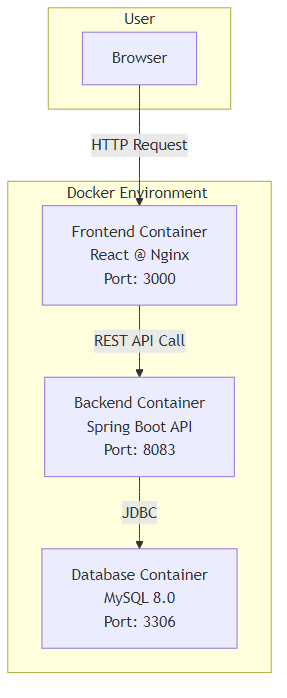

# Project Documentation: Student Management System

## 1. Overview

This document describes the technical architecture, technologies used, and setup instructions for the Student Management System project. The project is designed as a modern web application with separate backend and frontend layers, containerized for easy deployment and management.

## 2. System Architecture

The project is based on a **Client-Server** architecture.

- **Frontend (Client):** A Single Page Application (SPA) developed with React and TypeScript. It builds the user interface and communicates with the backend API via HTTP requests.
- **Backend (Server):** A RESTful API developed with Java and Spring Boot. It handles business logic, data validation, and database operations.
- **Database:** A MySQL 8.0 database is used to store student and user data.
- **Containerization:** The entire application (frontend, backend, database) is configured to run inside Docker containers. The `docker-compose` tool orchestrates these services, allowing them to be managed together easily.

Below is a diagram illustrating this architecture:



## 3. Technologies and Frameworks

### Backend

- **Language:** Java 17
- **Framework:** Spring Boot
  - **Spring Web:** For creating RESTful API endpoints.
  - **Spring Data JPA:** To simplify database operations.
  - **Spring Security:** For authentication and authorization, using a JWT (JSON Web Token) based security infrastructure.
- **Database:** MySQL
- **Database Migrations:** Flyway is used to version-control and manage database schema changes.
- **Dependency Management:** Maven

### Frontend

- **Library:** React
- **Language:** TypeScript
- **Styling:** Tailwind CSS
- **HTTP Client:** Axios (for API requests)
- **Routing:** React Router DOM
- **Dependency Management:** npm

### General

- **Container Technology:** Docker & Docker Compose

## 4. Running the Project

The project can be easily run using Docker and Docker Compose, which eliminates the need to manually install development environment dependencies.

### Prerequisites

- [Docker](https://www.docker.com/get-started)
- [Docker Compose](https://docs.docker.com/compose/install/) (Usually comes with Docker Desktop)

### Steps

1.  **Clone the Project:**
    ```bash
    git clone https://github.com/leventoner/school.git
    cd school
    ```

2.  **Start the Project with Docker Compose:**
    Run the following command in the project's root directory. This command will build the necessary images and start all services (backend, frontend, db).
    ```bash
    docker-compose up --build
    ```
    You can also run the services in the background by adding the `-d` flag: `docker-compose up --build -d`

3.  **Access the Application:**
    - **Frontend UI:** Open your browser and navigate to `http://localhost:3000`.
    - **Backend API:** The API endpoints are accessible at `http://localhost:8083`.

4.  **Stopping the Services:**
    To stop the application, press `Ctrl + C` in the terminal, or if you started it with the `-d` flag, run the following command:
    ```bash
    docker-compose down
